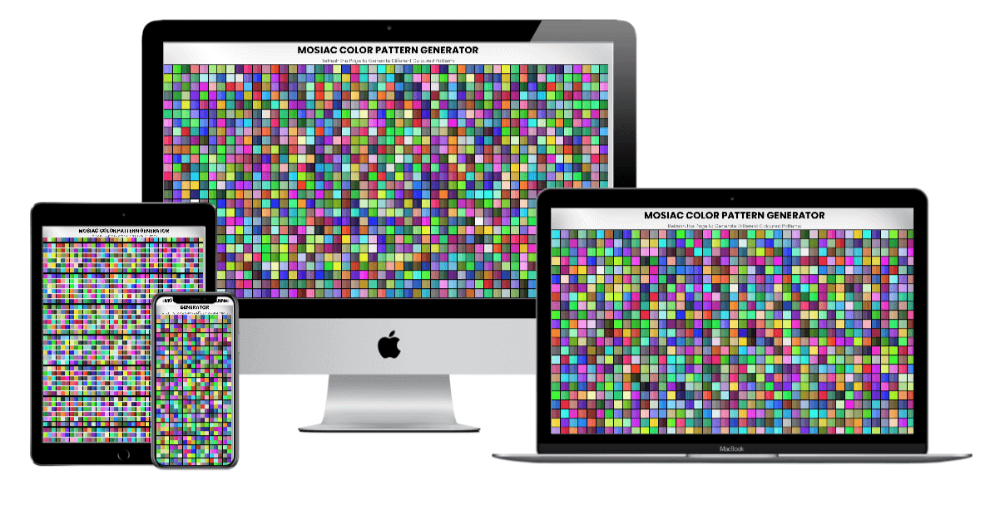

<h1 align = "center">
 
  
   
     
  Pattern Generator - HTML/CSS/JavaScript
   
</ H1>

<h3 align = "center"> Interactive Front End Development </h3>

## Color Generator

Math.floor, Math.random, chars.length, chars.substring, .forEach

## Project Specifications

- App generates generates different color patterns upon page/browser refresh.